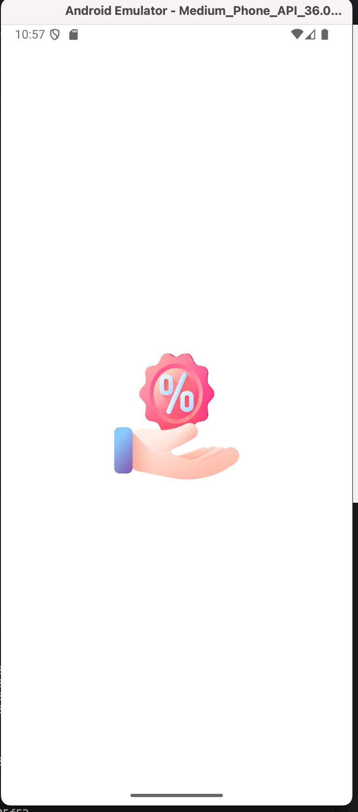
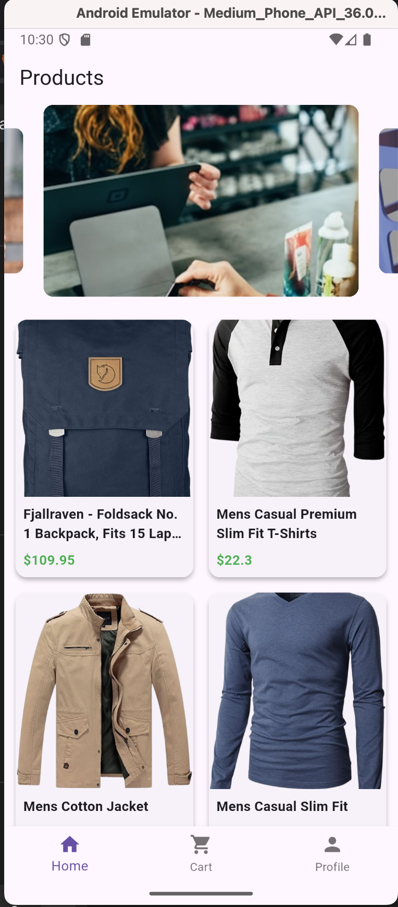
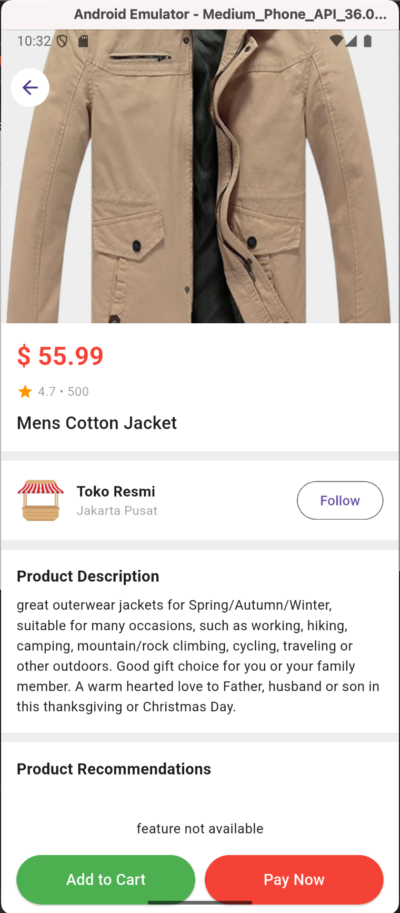
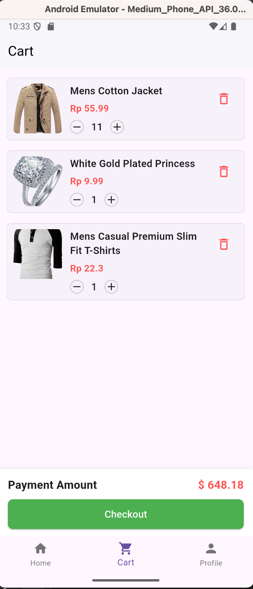
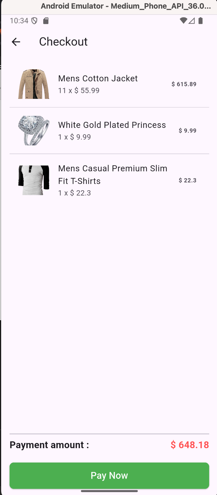
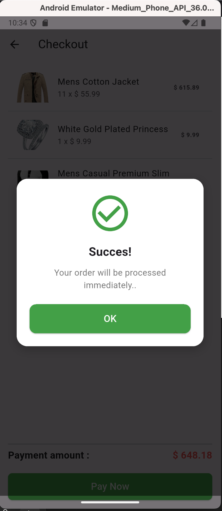
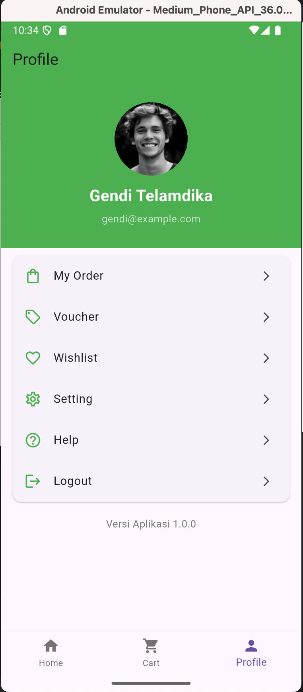

# shop_app

A new Flutter project.

## Getting Started

## 📦 Installation

1. Clone repository 

   git clone https://github.com/username/shop_app.git
   cd shop_app

2. Pastikan menggunakan Flutter versi 3.32.8
3. flutter pub get
4. flutter run

## 📸 Application Screenshots

| Splash | Home Page | Product Detail | Cart Page | Checkout | Payment Success | Profile |
|---------|-----------|---------------|-----------|-----------|------------------|---------|
|  |  |  |  |  |  | |

## 📦 Dependencies / Libraries Used

- **Flutter SDK**: 3.32.8  
- **[flutter_riverpod](https://pub.dev/packages/flutter_riverpod)** – State management
- **[lottie](https://pub.dev/packages/lottie)** – Render Lottie animations
- **[dio](https://pub.dev/packages/dio)** – Powerful HTTP client for Dart/Flutter
- **[carousel_slider](https://pub.dev/packages/carousel_slider)** – Image/content carousel slider
- **[hive](https://pub.dev/packages/hive)** – Lightweight key-value database
- **[hive_flutter](https://pub.dev/packages/hive_flutter)** – Hive integration for Flutter
- **[hive_generator](https://pub.dev/packages/hive_generator)** – Code generator for Hive (Dev dependency)
- **[build_runner](https://pub.dev/packages/build_runner)** – Code generation tool (Dev dependency)
